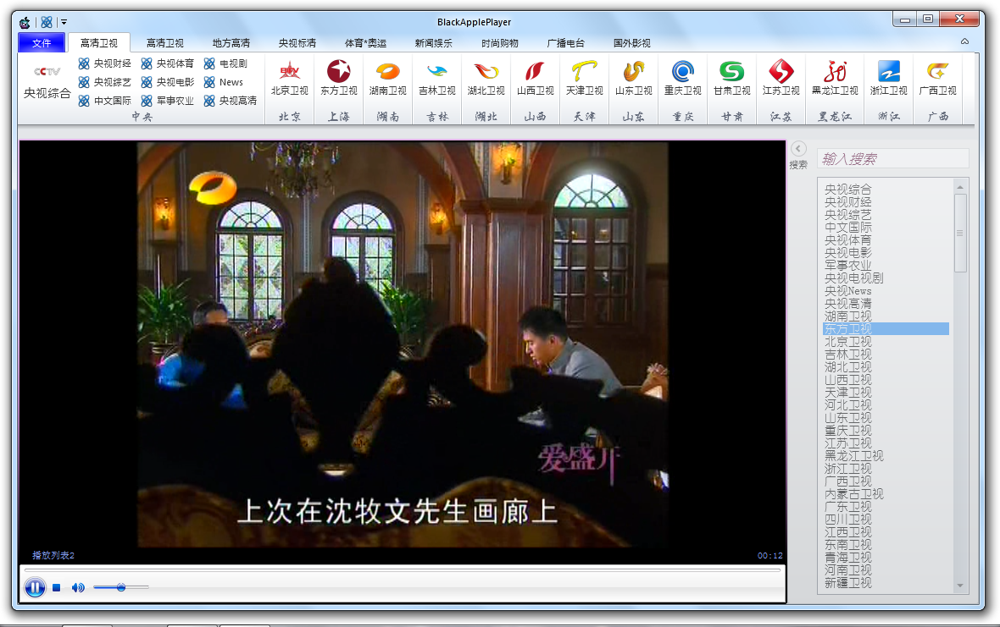

## BlackAppleplyaer 2.0
研究生期间开发的一款ipv6播放器，有基于wmp内核的和Vlc内核
 
BlackApplePlayer是一款界面相对精美、使用方便的IPV6电视直播软件，仿照微软Office 2010的结构布局，总体上还算看得过去的，还是值得体验一下的……
### 关于BlackApplePlayer

  * 1.BlackApplePlayer 是一款基于Windows Media Player和WPF组件Fluent开发的，所以如果你想使用的话，想安装软件的话，需要下载 并安装 .Net Framework 4.0，听说windows 8自带有.net Framework，这样的话你就不需要安装了。
  * 2.BlackApplePlayer 支持Office 2010支持的三种主题样式,office 2010 Silver（银色）、Blue（蓝色）、Black（黑色），呵呵用过Office 2010的人都知道银色和蓝色好看点。
  * 3.BlackApplePlayer能够高清收看到全国所有卫视，还有部分地方台的高清，总共好像有100多个电视节目源吧。
  * 4.右边设计了一个简单的搜索，不想显示的话，可以隐藏起来。

## 类库
Fluent.Ribbon:[https://github.com/fluentribbon/Fluent.Ribbon](https://github.com/fluentribbon/Fluent.Ribbon)
## 截图
   
